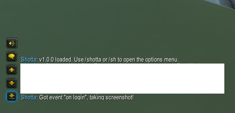
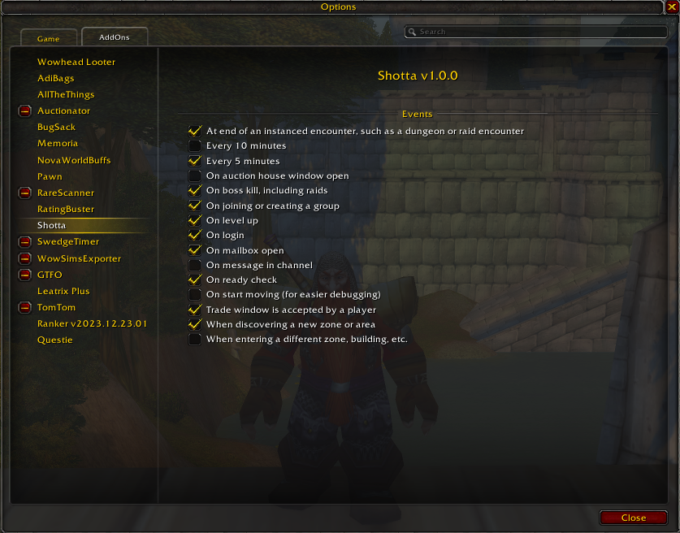

# Shotta

(_screen_)-shotta, mate. Automatically take screenshots of moments within
Azeroth so you can cherish them forever.

## Shotta Discord

Head over to our [Shotta Discord server](https://discord.gg/MHqGRpZxbB)!
Come share your best screenshots, tell us about your suggestions, or just chat!

## Features

Ever wished you had more pictures of your adventures throughout Azeroth and
beyond? Look no further!

Shotta will automatically take screenshots

- at regular intervals
- at specific events
- when you're alone
- when you're with your friends
- when you down a boss
- and much more!

It runs with zero dependencies and minimal code. I'm always adding new events as I come up with them and would love your feedback for what you'd like to see.

Screenshots will be saved to the local folders below, depending on operating
system and version of World of Warcraft you are playing.

On Windows (assuming WoW is installed to C drive):

- `C:\Program Files (x86)\World of Warcraft\_retail_\Screenshots`
- `C:\Program Files (x86)\World of Warcraft\_classic_era_\Screenshots`

On macOS:

- `\World of Warcraft\_retail_\Screenshots`
- `\World of Warcraft\_classic_era_\Screenshots`

## Installing

### CurseForge

You can download Shotta at the following link

- <https://www.curseforge.com/wow/addons/shotta>

### WoW Interface

You can download Shotta at the following link

- <https://www.wowinterface.com/downloads/info26687-Shotta.html>

### Wago

- <https://addons.wago.io/addons/shotta>

### WoWUp

[WoWUp] is a great open source Addon client.

Once installed, navigate to `Get Addons`, then either search for the addon, or click `Install from URL` and paste in the link to this
repository:

- <https://github.com/martinbjeldbak/shotta>

then click `Import`, you should see the below screen

Simply click `Install` and you're done! You will be prompted to update on any future releases. For more details, see the WoWUp guide [here][wowup-get-addons]

## Usage

Once installed, there will be an addon loaded message in the chat, see

You can then open the menu and start configuring the events you want to
screenshot by typing `/sh` or `/shotta` in the chat

Click the boxes you are interested in and they will trigger on the next time
that event occurs!

For example, on level up

I get this sweet screenshot

## Contributing

First of all, thanks for helping contribute! There are many ways you can help contribute

- filing feature request, bugs, or general issues using <https://github.com/martinbjeldbak/shotta/issues/new>
- code contributions
- translation strings for each supported language

> If you wish to run this addon locally, I highly recommend setting up a symlink
> to the cloned repository directory following the guide here:
> <https://wowpedia.fandom.com/wiki/Symlinking_AddOn_folders>, this will make it
> so that you only need to reload the UI with `/reload` to see your changes.

### TODO

- [ ] Ability to hide/show minimap icon
- [ ] Ability to take 2 screenshots for every event: 1 with UI, 1 without
- [ ] Setting to take screenshots with or without UI
- [ ] More translation strings, see `localization.core.lua`
- [ ] UI Button: Reset state to default
- [ ] Settings are global: make profile or chracter-specific bindings
- [x] [Timer](https://wowpedia.fandom.com/wiki/API_C_Timer.After) after ie 10s after readcheck
- [x] Add slash command to open up options (if possible?)
- [x] ~~Consider using [AceDB](https://www.wowace.com/projects/ace3)~~ too complicated, extra dependency
- [ ] Make event success printing an option. Currently always printing to chat
- [x] Create a better options frame - Could be 2 columns of events in case of too many events
- [ ] If simpler: Implement the settings UI (+ more) using [Ace3](https://www.curseforge.com/wow/addons/ace3)

### Event ideas

not sure if any of these are possible

- [x] Boss/Rare/elite kills
- [x] Every 5/10 minutes
- [x] On death
- [ ] When joining a party (with a friend)
- [ ] When close to a friend
- [ ] When emoting with a friend/target
- [x] When emoting at all
- [ ] Low health
- [x] Trade windows
- [ ] More customizable every x minutes with [slider](https://wowpedia.fandom.com/wiki/API_Slider_SetStepsPerPage)
- [ ] Reputation level ups ([event](https://github.com/AtheneGenesis/Vanilla_enUS_FrameXML/blob/master/GlobalStrings.lua#L1944))
- [ ] PvP: Arena endings
- [ ] PvP: Battleground endings
- [ ] PvE: Mythic+ dungion runs

Full event list [here](<https://wowwiki-archive.fandom.com/wiki/Events_A-Z_(full_list)>)

### Consider events

- [`CHAT_MSG_BN_INLINE_TOAST_ALERT`](https://wowpedia.fandom.com/wiki/CHAT_MSG_BN_INLINE_TOAST_ALERT)
- [`CHAT_MSG_LOOT`](https://wowpedia.fandom.com/wiki/CHAT_MSG_LOOT)

## Resources

- [WoW API](https://github.com/Gethe/wow-ui-source)
- [Events](https://warcraft.wiki.gg/wiki/Events)

### Similar addons

- [Memoria](https://www.curseforge.com/wow/addons/memoria), simpler triggers
- [Multishot](https://www.wowinterface.com/downloads/info9590-MultishotScreenshot.html), not updated since april 2015

[WoWUp]: https://wowup.io/
[wowup-get-addons]: https://wowup.io/guide/get-addons/overview
