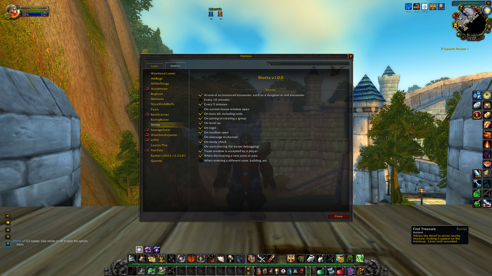

# Screenshotter

Automatically take screenshots of moments within Azeroth so you can cherish
them forever.

> [!IMPORTANT]
> This has only been tested in WoW Classic, but it should work in all client versions

## Features

Ever wished you had more pictures of your adventures throughout Azeroth and
beyond? Look no further!

Screenshotter will automatically take screenshots

- at regular intervals
- at specific events
- when you're alone
- when you're with your friends
- when you down a boss

It runs with zero dependencies and minimal code.

## Installing

Currently [WoWUp] is the only known supported addon client because it supports
installing Addons directly from GitHub. I have not released this to Curseforge,
WoWInterface, Wago, etc. yet.

Go to `Get Addons`, then `Install from URL` and paste in the link to this
repository:

- <https://github.com/martinbjeldbak/screenshotter>

then click `Import`, you should see the below screen

Simply click `Install` and you're done! You will be prompted to update on any future releases. For more details, see the WoWUp guide [here][wowup-get-addons]

## Usage

## Contributing

### TODO

- [ ] UI Button: Reset state to default
- [ ]Settings are global: make profile or chracter-specific bindings
- [x] [Timer](https://wowpedia.fandom.com/wiki/API_C_Timer.After) after ie 10s after readcheck
- [x] Add slash command to open up options (if possible?)
- [x] ~~Consider using [AceDB](https://www.wowace.com/projects/ace3)~~ too complicated, extra dependency

### Event ideas

not sure if any of these are possible

- [ ] Boss/Rare/elite kills
- [x] Every 5/10 minutes
- [ ] When joining a party (with a friend)
- [ ] When close to a friend
- [ ] When emoting with a friend/target
- [ ] When emoting at all
- [ ] Low health
- [x] Trade windows
- [ ] More customizable every x minutes with [slider](https://wowpedia.fandom.com/wiki/API_Slider_SetStepsPerPage)
- [ ] Reputation gains
- [ ] PvP: Arena endings
- [ ] PvP: Battleground endings
- [ ] PvE: Mythic+ dungion runs

Full event list [here](https://wowwiki-archive.fandom.com/wiki/Events_A-Z_(full_list))

### Consider events

- [`CHAT_MSG_BN_INLINE_TOAST_ALERT`](https://wowpedia.fandom.com/wiki/CHAT_MSG_BN_INLINE_TOAST_ALERT)
- [`CHAT_MSG_LOOT`](https://wowpedia.fandom.com/wiki/CHAT_MSG_LOOT)

## Resources

- [WoW API](https://github.com/Gethe/wow-ui-source)

### Similar addons

- [Memoria](https://www.curseforge.com/wow/addons/memoria), simpler triggers
- [Multishot](https://www.wowinterface.com/downloads/info9590-MultishotScreenshot.html), not updated since april 2015

[WoWUp]: https://wowup.io/
[wowup-get-addons]: https://wowup.io/guide/get-addons/overview
